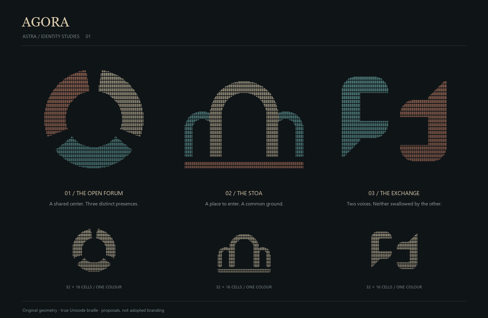

# Agora — Astra identity studies

These are three **proposals for visual selection**, not adopted branding. The
project README and runtime are deliberately unchanged.



## Directions

1. **The open forum** — three substantial presences around an empty common
   center. My preferred direction: the space between the participants is the
   subject, without drawing a central controller. Its risk is familiarity with
   other segmented-ring marks; this is a concept exploration, not a trademark
   clearance.
2. **The stoa** — a higher central arch and two smaller bays over shared ground.
   The architectural direction; more place than interface. The first single-arch
   experiment looked like headphones and was rejected during visual review.
3. **The exchange** — two facing, hooked voice forms. An explicit conversation
   mark with a clear division between the participants. More literal and less
   abstract than the forum.

The palette is limestone, oxidized teal and copper against charcoal. The smaller
monochrome specimens are independently sampled at 32 × 16 cells, not just reduced
versions of the large 64 × 32-cell raster.

## Reproduce

```sh
python -m pip install Pillow==10.4.0
python docs/logo/generate.py
```

The generator contains original analytic geometry. It samples each dot at nine
sub-pixel points, packs the resulting occupancy into actual Unicode braille
characters, and renders those same bits as circles. Blank text cells are U+2800;
every row has equal width. Each PNG has a transparent background.

One colour is assigned per braille cell, not per dot. The raster's mean lattice
pitch is square: horizontal cell gap 3 / vertical cell gap 6 with dot pitch 6.
Geometry has no font dependency. Presentation labels use Georgia and Segoe UI
on Windows, falling back to DejaVu on Linux; sheet-label pixels may differ by
installed fonts. The reviewed render used Pillow 10.4.0 on Windows.

The generator asserts occupancy/bit roundtrips, equal text widths and blank
outer edges at both sizes. `geometry-checks.json` records dimensions and lit-dot
counts. Repeated generation in the same environment must leave the assets
unchanged. These checks are geometry checks, not evidence of terminal-font
rendering parity.

Files: `forum`, `stoa`, `voices`, each as `.txt` and `.png`, plus the corresponding
`-compact` pair. `astra-studies.png` is the comparison sheet.

Each full-size candidate also has a `.gif`: a diagonal highlight crosses fixed
geometry, followed by a quiet rest, on a 4.8-second loop. The entire GIF shares
one colour palette. `*-shimmer-frames.png` samples decoded GIF frames so the
animation can be inspected independently of its source rendering.
`*-gif-poster.png` is its decoded first frame. Palette samples use nearest-neighbour
sampling: averaging a dense dot field into a thumbnail loses the bright dot colours
and produces an incorrectly dark GIF even when the source PNG is bright.

The separate [lead-dev exploratory sheet](exploratory-lead-dev/studies.png) is
retained as a different author's sketch set. Its original generator was
overwritten in a crossed worktree and is not recoverable from the branch; those
older rasters are **not** outputs of this generator. No artifact was deleted.

## Selection boundary

Choose a direction before polishing the README lockup or light/dark treatment.
A README change belongs to a subsequent selected-brand patch, not to this
candidate gallery. The requested shimmer is included for comparison; no final
brand claim is made.
