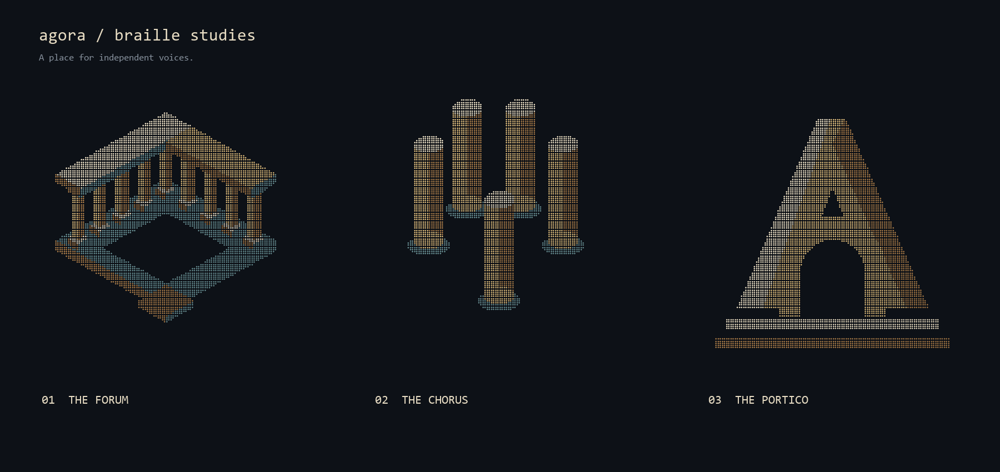

# Agora — first branding studies

These are candidates for human review, not a settled brand. The root README on
this proposal branch uses **Forum**, the recommended direction, to make the choice
concrete in its intended setting.



## Recommendation: Forum

A place to gather, with room left for its participants. Two colonnaded wings meet
at a common corner above a shared floor. Limestone and warm gold carry the
architecture; blue-green gives the floor its own presence. The open centre is the
subject of the mark. Its quiet geometry suits a terminal while the dense dots
give the README version texture.

This borrows the braille medium from the AmoreOS reference, with a distinct
silhouette and palette. The conceptual image exploration preceded these assets;
the committed marks themselves come entirely from the generator's geometry.

**Chorus** explores distinct equal-height voices without a commanding centre.
Its cylindrical forms also read as candles, a weaker fit for the product.
**Portico** combines an A with a traversable doorway. It is the strongest compact
monogram, but is less distinctive and more institutional than Forum.

## Build and representations

```sh
python -m pip install Pillow
python docs/logo/generate.py
```

Pillow is a maintainer-only image build dependency; Agora's runtime is unaffected.
All shape geometry is computed in a 128×128 dot field, supersampled 3×3. Each
`.txt` contains the same mask in 64×32 Unicode braille cells. The generator checks
every decoded dot against the shape mask. Background PNG and transparent PNG
versions are provided. The square mean dot pitch is preserved across cell gaps.
Color is a raster treatment; the plain text assets preserve the monochrome mark.

The generator uses an optional local font for sheet labels only. No font decides
the mark's silhouette. Review the 340px README display as well as the larger
study sheet; tiny avatars would need a separately judged compact tier.

Animation is deliberately undecided at this stage. A later slow light sweep can
add life while leaving the form still; constant rotation would change its meaning
from a place to a loading indicator.
