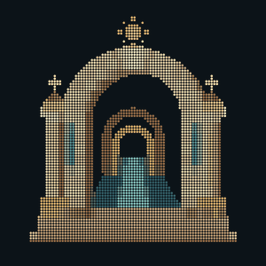

# Common Gate

Agora's chosen mark: a gold braille gateway, supported columns and an open,
illuminated passage. Designed for the project and selected by the project
owner after two rounds of architectural studies.



The main README uses the native **300 × 300** shimmer animation. Clicking it
opens the [still image](mark/threshold-readme-300.png).
The quiet highlight loops every 4.8 seconds; the geometry stays fixed.

- [Large transparent PNG](mark/threshold.png)
- [512px shimmer](mark/threshold.gif)
- [Full braille text](mark/threshold.txt) and [cell colours](mark/threshold.colors.json)
- [Compact braille text](mark/threshold-compact.txt) and [cell colours](mark/threshold-compact.colors.json)
- [Generator and study gallery](mark/README.md)

## Regenerate

Build-time dependencies only: Python 3 and Pillow 10.4.0. Agora's runtime does not
use either. The original geometry and both sampling tiers live in one generator:

```sh
python -m pip install Pillow==10.4.0
python docs/logo/mark/generate.py
python docs/logo/mark/check-refinement.py
```

The checks cover braille encoding, margins, mirrored finials, cross proportions,
sun rays, column support and animation dimensions/duration. The study gallery
retains the other candidates as design history; Common Gate is the selected mark.
