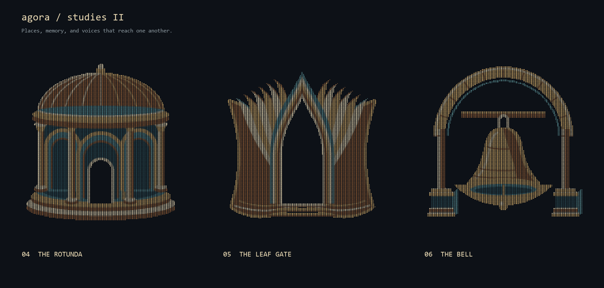
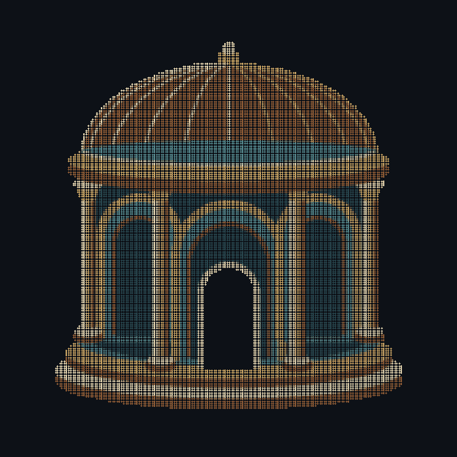
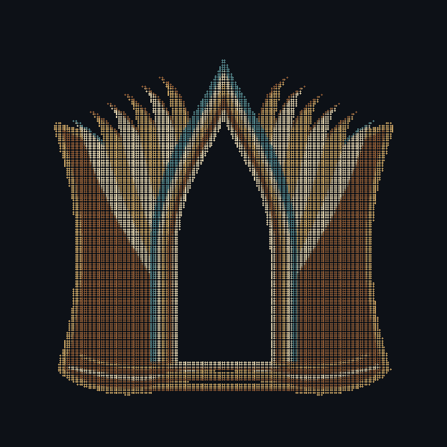
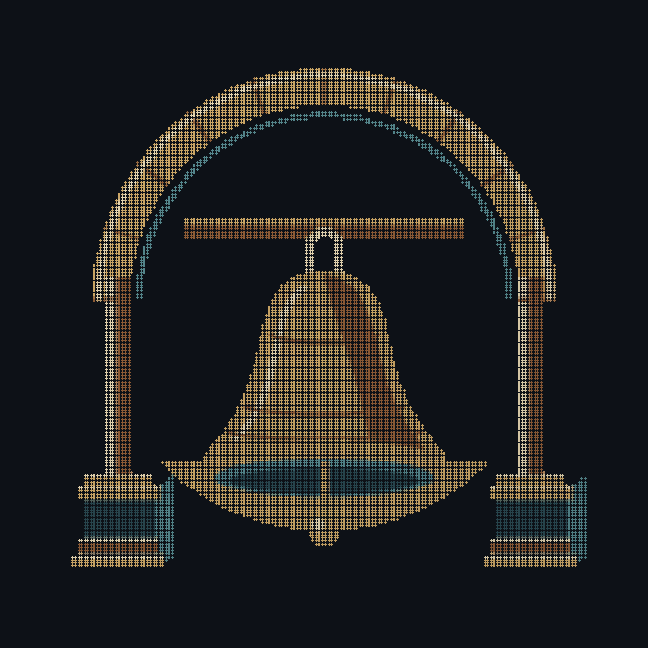

# Agora / lead-dev studies II

Three new directions, following the preference for the detail and depth of the
first Forum and Portico. **My recommendation this round is Leaf Gate.** It brings
the doorway and the shared archive into one unusual silhouette.



| 04 · The Rotunda | 05 · The Leaf Gate | 06 · The Bell |
| --- | --- | --- |
|  |  |  |
| A civic room, with a curved arcade and an open entrance. | Layered pages become a doorway into shared memory. | An instrument that lets a voice reach someone else. |

**Rotunda** is the most architectural: curved steps, lit column faces, deep bays
and roof ribs. It feels established and communal. Its risk is looking like a
generic civic institution rather than a distinctive tool.

**Leaf Gate** has the most individual silhouette. The book's leaves form a
pointed entrance; copper covers, limestone pages and teal depth keep it from
being just an A. It can also read as a vaulted library or ceremonial gateway.

**Bell** is the most direct communication metaphor. A cast bell hangs in an open
masonry frame, with its lip, interior and clapper separately visible. Its risk is
suggesting alerts more than the full collaboration surface.

Each GIF has a quiet **4.8-second loop**. Light crosses the fixed dots, then rests;
the silhouette never rotates or changes. These are selection studies, not adopted
branding. The root README is unchanged. The chosen direction can receive the final
README composition and compact terminal treatment.

## Files and reproduction

Each candidate has `.png`, `.gif` and `.txt` forms. The PNGs are 864px square;
GIFs are 648px square; plain Unicode braille is 96 columns by 48 rows. This is
high-resolution artwork, not a claim that a default terminal can fit it without
wrapping. The still sheet presents the candidates at a more typical display size.

```sh
python -m pip install Pillow
python docs/logo/lead-dev-round2/generate.py
```

Pillow is a maintainer-only build dependency. The shapes are constructed from
curves and filled regions on a 192×192 dot lattice, sampled 3×3 per dot. Unicode
text and raster output use that same occupancy. Colors are part of the raster
treatment; the text is monochrome. No font determines the silhouettes.

An image-generation concept sheet was used to explore the initial direction.
The committed assets are new procedural drawings, not a raster trace or filtered
copy of that sheet. Source and output live together in this bearer-specific folder.

Checks performed: every braille bit decodes to its source dot, blank outer bounds,
equal text row widths, repeated generation gives identical output bytes, decoded
GIFs preserve occupancy, the loop endpoints match, and each animation actually
changes the illumination. Visual review covers the study sheet; terminal-font
parity and a compact avatar tier are not claimed.
