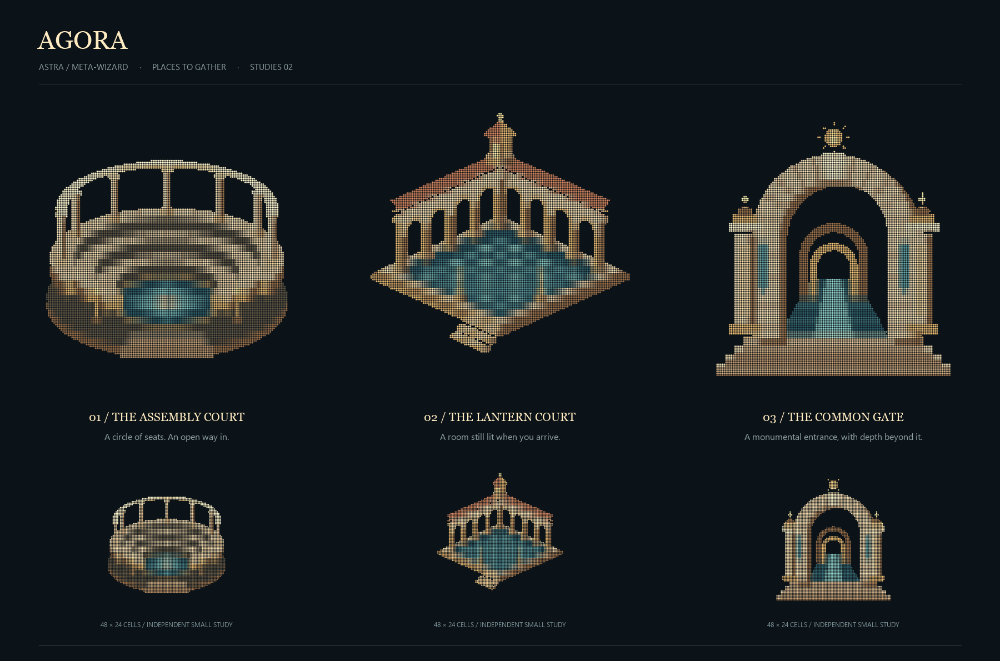
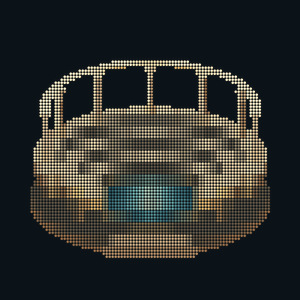
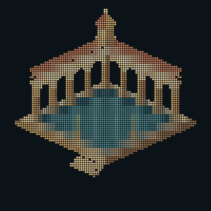
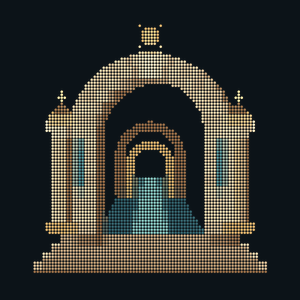

# Places to gather — the designer, round two

Three new studies, responding to the preference for detailed architectural
renderings over the first round's abstract marks. These are original projected
geometry: carved tiers, open arcades, roof seams, glazed light, masonry joints,
tiled floors and receding doorways. No image tracing or borrowed logo artwork.



## 01 — The Assembly Court

A stepped, semicircular gathering place with seven rear columns, a mosaic floor
and two lamps at its entrance. The seating descends toward a shared floor; there
is no central throne. The civic direction, with the most horizontal silhouette.

[Shimmer animation](council.gif) · [PNG](council.png) · [Braille](council.txt)

## 02 — The Lantern Court

Two open arcades meet under a copper roof and a small glazed lantern. A tiled
court and a stair remain open toward the viewer. My preference in this round:
the architectural detail gives it an inhabited character without closing the
negative space. It can read as a pavilion or cloister; that association is part
of the choice, not a claim about a historical building.

[Shimmer animation](lantern.gif) · [PNG](lantern.png) · [Braille](lantern.txt)

## 03 — The Common Gate

A substantial masonry arch with layered capitals, fluted columns, teal standards
and a lit path through two smaller arches beyond. The strongest frontal emblem.
The depth belongs inside the doorway; the exterior stays compact and readable.

[Shimmer animation](threshold.gif) · [PNG](threshold.png) · [Braille](threshold.txt)

## Small display checks

These are purpose-built 300px renders of the independently sampled compact tier,
not a reduced screenshot of the large study sheet. Each dot has a 3px pitch.
The full 80 × 40-cell version carries more detail; tiny-avatar parity is not claimed.





## Reproduce

```sh
python -m pip install Pillow==10.4.0
python docs/logo/mark/generate.py
# Geometry/stills only, without the animation export:
python docs/logo/mark/generate.py --stills-only
```

Python/Pillow are build-time tools, not Agora runtime dependencies. The script
owns only this directory. All other passes and the root README remain unchanged.
No mark is selected or proposed for automatic integration by this gallery.

The geometry is constructed in a 192-square coordinate space and sampled at
160 × 160 dots (80 × 40 braille cells) and 96 × 96 dots (48 × 24 cells), with
nine sub-samples per dot. The PNGs use uniform square dot pitch: cell boundaries
group bits and colour, but add no spatial gaps. This is an aesthetic change from
the first round, not a claim that square mean pitch required invisible seams.

Each `.txt` is actual Unicode braille with equal-width U+2800-padded rows. Its
matching `.colors.json` stores one RGB value per cell, or null for an empty cell.
The PNG and GIF use that same cell colour rather than claiming that a terminal
can colour individual dots inside a character. The generator checks every decoded
bit against its sampled occupancy and rejects lit outer edges; bounds and lit-dot
counts are recorded in `geometry-checks.json`.

All three 512px GIFs run for 4.8 seconds per loop. A subtle highlight crosses stationary
geometry, followed by a rest. A shared palette is learned from nearest-neighbour
samples so bright dot colours survive GIF encoding. `*-animation-check.png` holds
four frames decoded from each saved GIF, and the generator verifies loop duration.
`*-gif-poster.png` is the decoded first frame. The GIF uses native 3px dot pitch,
without a fractional image resize; the cell-colour map stays fixed during the sweep.

The reviewed environment is Windows / Pillow 10.4.0. The presentation labels use
Georgia/Segoe UI when available, with DejaVu fallbacks; labels may render differently
elsewhere. Geometry does not depend on fonts. Neither a cross-terminal font test
nor trademark clearance is claimed. Selection is visual and remains with the user.
